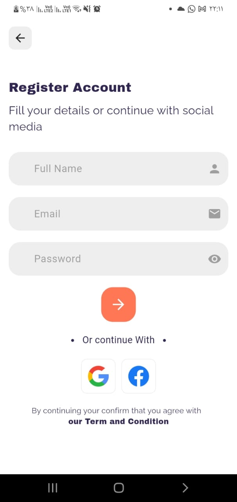
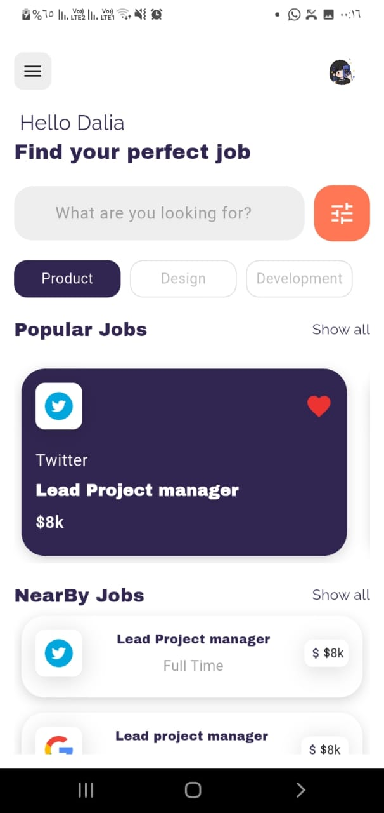
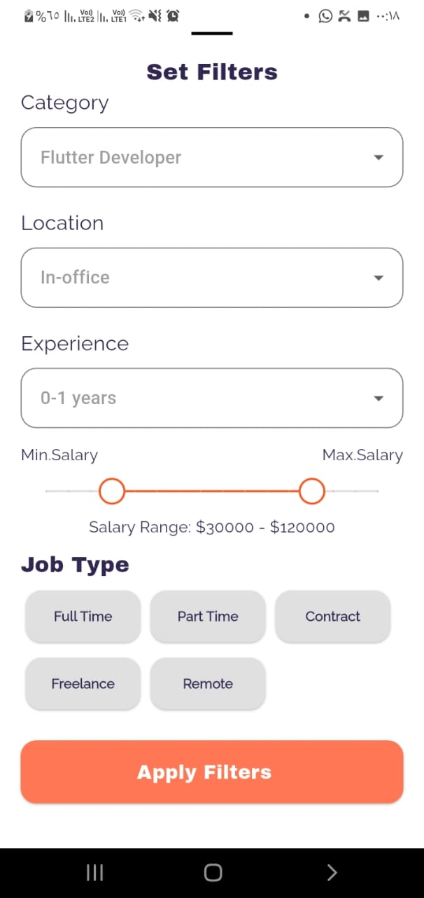

# 💼 Job Finder – Flutter Job Search Application  

Job Finder is a modern and professional Flutter mobile application designed to help users search, explore, and apply for jobs easily and securely.  
The app provides a smooth user experience with real-time data, clean architecture, and secure authentication.

---

## 🚀 Features  

### 🔐 Authentication  
- Secure user registration & login using Firebase Authentication  
- Email & Password authentication  
- Google & Facebook login UI ready  
- Safe user session handling  

### 🔎 Job Seeker Features  
- Browse available jobs  
- View full job details  
- Apply for jobs directly  
- Save jobs to favorites  
- Real-time job updates from Firestore  

### ⚡ App Experience  
- Clean and modern UI  
- Fast performance  
- Smooth navigation  
- Real-time data synchronization  

---

## 📱 App Screens  


| Register Screen | Home Screen | 
|:-------------:|:-------------:|
 |  

| Job Details | Content Filters | 
|:------:|:------:|
|   |  

---

## 🛠️ Tech Stack  

- Flutter – Mobile application development  
- Dart – Programming language  
- Firebase Authentication – Secure user login  
- Cloud Firestore – Real-time cloud database  
- Cubit (Bloc) – State management  

---

## 🧠 Architecture  

- Clean Architecture principles  
- Separation of UI & Business Logic using Cubit  
- Scalable and maintainable codebase  

---

## ✨ Upcoming Inhancement 

- User can upload a Voice and video record to introduce him self 
- Admin dashboard for job posting  
- Smart job recommendations 

## ⚙️ Installation & Setup  

### 1️⃣ Clone the project  
```bash
git clone https://github.com/your-username/job-finder.git
cd job-finder
